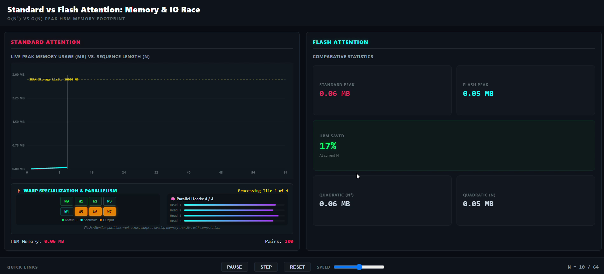

# The Evolution of FlashAttention

> **From Naive Attention to FlashAttention-3** — a complete benchmark suite and step-by-step PyTorch simulation tracking how attention went from a memory-bound bottleneck to a hardware-optimized kernel running at 75% of peak GPU throughput.

Related article: [The Great Memory Race: Understanding the Foundational Bottleneck Behind FlashAttention](https://drahulprasanth.substack.com/p/the-great-memory-race-understanding?r=8xw9mx&utm_campaign=post&utm_medium=web)

---

## Interactive Visualizations & Simulations

To make the mechanics of FlashAttention intuitive, this repository includes three standalone HTML interactive simulations. A **simulation** is a functional representation of an algorithm's execution flow and hardware usage, demonstrating how data propagates across different memory layers (HBM vs. SRAM) and GPU thread structures (Warps) under varying workloads.

Below are the recorded walkthroughs of these simulations with a technical analysis of what they demonstrate:

### 1. Naive vs. Flash Memory Scaling Race
This simulation shows standard attention's quadratic $O(N^2)$ memory explosion compared side-by-side with FlashAttention's linear $O(N)$ memory footprints as the sequence length $N$ scales from 1 to 64.

[](Recordings/Comparison.mp4)
*👉 Click the preview above to play the Comparison.mp4 video*

**Key Inference:**
- **Standard Attention (Red Line):** Curves quadratically upward. At $N=64$, standard attention consumes **2.46 MB** of HBM to store the full attention matrix. In actual LLMs with large batch sizes and multiple heads, this footprint easily exceeds GPU SRAM memory limits (modeled by the 10,000 MB barrier in the simulation), creating a massive HBM read/write bottleneck.
- **Flash Attention (Cyan Line):** Scales flat at **0.32 MB** ($O(N)$ complexity) because intermediate attention scores are discarded.
- **GPU Warp Specialization:** The simulation visualizes the underlying execution pipeline:
  - **🟢 MatMul (W0-W2):** active during $Q \times K^T$.
  - **🔵 Softmax (W3-W4):** active during Online Softmax updates.
  - **🟠 Output (W5-W7):** active during output matrix writing ($P \times V$).
  - **🧠 Parallel Heads:** shows 4 heads executing concurrently, overlapping memory loads with computation.

---

### 2. Tiling & Online Softmax Flow
This simulation walks through FlashAttention's tiling mechanism on a $10 \times 10$ attention matrix partitioned into $5 \times 5$ blocks.

[](Recordings/Flash%20Attention.mp4)
*👉 Click the preview above to play the Flash Attention.mp4 video*

**Key Inference:**
- Instead of computing all 100 cells at once, FlashAttention loads one row tile ($Q_i$) and column tile ($K_j$) into fast on-chip **SRAM**.
- You can watch the active block progress tile-by-tile.
- The formula panel updates dynamically to show how **Online Softmax** keeps running statistics ($m$ for max, $l$ for sum-exp) and updates the output accumulator $O$ in SRAM, avoiding saving any intermediate attention values to HBM.

---

### 3. Naive Attention Cell-by-Cell Processing
This simulation demonstrates standard attention's naive process, showing how it must compute and store the full matrix layout to calculate softmax probabilities.

[](Recordings/Standard%20Attention.mp4)
*👉 Click the preview above to play the Standard Attention.mp4 video*

**Key Inference:**
- Every single cell in this grid represents an embedding dot product ($Q_i \cdot K_j$) that must be written out to slow HBM before softmax can run.
- As the sequence length scales, this grid becomes extremely dense, showing why long-context sequence lengths quickly trigger Out-Of-Memory (OOM) errors in standard models.

---

## What is Attention?

Self-attention is the core of every Transformer model. Given a sequence of tokens, it computes how much each token should "attend" to every other by projecting into Query ($Q$), Key ($K$), and Value ($V$) matrices, then:

$$\text{Attention}(Q, K, V) = \text{softmax}\!\left(\frac{QK^T}{\sqrt{d_k}}\right) V$$

**The problem:** this produces an intermediate $N \times N$ attention matrix, where $N$ is the sequence length.

| Sequence Length | Attention Matrix Size (B=4, H=8, FP16) |
|:---:|:---:|
| 512 | 48 MB |
| 1 024 | 152 MB |
| 2 048 | **552 MB** |
| 32 768 | **~14 GB** — per layer |

At modern LLM scale, that matrix alone exceeds the VRAM of most GPUs — and that is just for *one* layer.

---

## Why We Need FlashAttention

Standard attention is not compute-bound — it is **memory-bound**. Modern GPUs can perform trillions of FLOPs per second, but their bottleneck is reading and writing to High Bandwidth Memory (HBM):

1. Compute $QK^T$ → **write** $N \times N$ matrix to HBM
2. Read it back for softmax → **write** probabilities back to HBM
3. Read probabilities → **write** $AV$ output to HBM

**FlashAttention** eliminates all intermediate HBM traffic by computing attention in small **tiles** that stay inside fast on-chip SRAM, using **Online Softmax** to accumulate running statistics block-by-block — so the full $N \times N$ matrix is **never materialized in HBM**.

---

## Repository Structure

```
FlashAttention/
│
├── Standard Attention/
│   ├── benchmark_naive_attention.py       ← CPU vs GPU baseline benchmark
│   ├── standard-attention-cpu.ipynb       ← CPU walkthrough notebook
│   └── standard-attention-gpu.ipynb       ← GPU walkthrough notebook
│
├── Flash Attention/                        ← FlashAttention-1 (FA1)
│   ├── README.md                          ← FA1 overview
│   ├── benchmark_fa1.py                   ← FA1 vs naive memory & latency benchmark
│   ├── flash_attention_benchmark.ipynb    ← Kaggle-compatible interactive notebook
│   └── analysis_results.md               ← Mathematical proof of O(N^2) memory scaling
│
├── Flash Attention 2/                      ← FlashAttention-2 (FA2)
│   ├── README.md                          ← FA2 deep-dive (loops, warps, Split-KV)
│   ├── flash_attention_2_demo.ipynb       ← Python simulation + FLOPs/HBM analysis
│   ├── flashattention-2-fa2.ipynb         ← Alternate Kaggle notebook
│   └── analysis_fa2_fa3.md               ← GFLOPs, HBM traffic, and arithmetic intensity
│
└── Flash Attention 3/                      ← FlashAttention-3 (FA3)
    ├── README.md                          ← FA3 deep-dive (TMA, WGMMA, FP8)
    ├── flash_attention_3_demo.ipynb       ← FP8 simulation + async TMA pipelining demo
    └── flashattention-3-fa3.ipynb         ← Alternate Kaggle notebook
```

---

## FlashAttention-1 (FA1)

> *"Bring the computation to the data, not the data to the computation."*

**Published:** Tri Dao et al., NeurIPS 2022
**Key innovation:** IO-aware exact attention via tiling + Online Softmax

### The Problem It Solves

Before FA1, training Transformers beyond 2 048 tokens was impractical on a single GPU. The quadratic $O(N^2)$ memory footprint caused OOM errors, and the HBM round-trips made attention the dominant bottleneck — not because of math, but because of memory traffic.

### How It Works

**Tiling:** Instead of computing the full $N \times N$ matrix at once, FA1 splits $Q$, $K$, $V$ into small blocks that fit in SRAM. The block sizes are carefully chosen to never exceed SRAM capacity.

**Online Softmax:** For each tile pair $(Q_i, K_j)$, FA1 maintains running statistics *without* seeing all values first:

$$m_i^{\text{new}} = \max(m_i,\ \tilde{m}_{ij})$$

$$l_i^{\text{new}} = e^{m_i - m_i^{\text{new}}} \cdot l_i + e^{\tilde{m}_{ij} - m_i^{\text{new}}} \cdot \tilde{l}_{ij}$$

$$O_i^{\text{new}} = \frac{l_i \cdot e^{m_i - m_i^{\text{new}}} \cdot O_i + e^{\tilde{m}_{ij} - m_i^{\text{new}}} \cdot \tilde{P}_{ij} V_j}{l_i^{\text{new}}}$$

This produces the **exact same result** as standard softmax — zero approximation.

### Results

| Metric | Standard Attention | FlashAttention-1 |
|:---|:---:|:---:|
| Memory complexity | $O(N^2)$ | $O(N)$ |
| Peak VRAM at N=2048 | 552 MB | **40 MB** |
| Runtime at N=2048 (T4) | 9.46 ms | **3.34 ms** |
| HBM Traffic Reduction | — | ~7.6x |
| Accuracy | Exact | Exact |

### Where It Is Used
- First generation long-context LLMs (Llama 1, MPT, Falcon)
- PyTorch 2.0 `scaled_dot_product_attention` (first integration)
- Training runs requiring sequence lengths > 2 048

---

## FlashAttention-2 (FA2)

> *"FA1 fixed memory. FA2 fixed compute."*

**Published:** Tri Dao, 2023
**Key innovation:** Restructured loops, delayed normalization, warp-level partitioning

### The Problem It Solves

FA1 achieved only **20–40% of peak GPU Tensor Core throughput**. Three root causes:

1. **Excessive CUDA Core usage:** The inner loop divided by $l_i$ at *every iteration* — slow scalar operations on CUDA ALUs instead of Tensor Cores.
2. **Warp synchronization overhead:** Warps had to write intermediate partial sums to shared memory and synchronize via `__syncthreads()` barriers, stalling the pipeline.
3. **Low SM occupancy:** During LLM inference (batch size = 1), parallelism over `batch x heads` left most Streaming Multiprocessors idle.

### How It Works

#### 1. Flipped Loop Order

| | FA1 | FA2 |
|:---|:---|:---|
| **Outer loop** | K, V columns | Q rows |
| **Inner loop** | Q rows | K, V columns |
| **Output writes** | Reloaded from HBM every outer step | Written to HBM **once** at end |

By loading a block of $Q_i$ into registers and iterating over all $K, V$ blocks in the inner loop, $O_i$ is computed completely in SRAM and written out exactly once.

#### 2. Delayed Normalization (Fewer Non-Matmul FLOPs)

FA1 divided by $l_i^{\text{new}}$ inside every inner-loop iteration. FA2 stores the **un-normalized accumulator** $S_i = O_i \cdot l_i$ in registers and performs a single division only after the inner loop completes:

$$S_i^{\text{new}} = e^{m_i - m_i^{\text{new}}} \cdot S_i + e^{\tilde{m} - m_i^{\text{new}}} \cdot \tilde{P}_{ij} V_j$$

$$O_i = \frac{S_i}{l_i} \quad \leftarrow \text{computed once per Q block}$$

This removes expensive divisions from the hot path entirely.

#### 3. Warp Row Partitioning

Each warp is assigned a **unique slice of $Q$ rows** and computes its GEMM independently. $K$ and $V$ are shared. No warp-to-warp communication, no `__syncthreads()`, no shared memory write/read barriers.

#### 4. Split-KV Parallelism

Sequence length is split into segments assigned to different SMs. Partial outputs are reduced at the end — ensuring high GPU occupancy even at batch size = 1.

### Results

| Metric | FA1 | FA2 |
|:---|:---:|:---:|
| Peak GPU Utilization | 20–40% | **50–73%** |
| Speedup over FA1 | 1x | ~2x |
| HBM Write Traffic | O(Tc * Tr) | O(Tr) — linear |
| Divisions in hot loop | Every step | **Once per Q block** |
| Warp synchronization | Required | **Eliminated** |

### Where It Is Used
- **Hugging Face Transformers**: `attn_implementation="flash_attention_2"`
- **LLaMA 2 / 3**, **Mistral**, **Mixtral**, **Gemma** — default training attention
- **vLLM** and **TGI** for high-throughput inference serving
- Any Ampere+ GPU (A100, RTX 3090+) in production pipelines

---

## FlashAttention-3 (FA3)

> *"FA3 is not just a faster kernel — it is a different execution model."*

**Published:** Tri Dao, Jay Shah et al. (NVIDIA + Colfax), 2024
**Key innovation:** Hopper-native async pipelining (TMA + WGMMA) + FP8 support

### The Problem It Solves

FA2 was designed for **Ampere** and left three major Hopper hardware features completely unused:

| Hopper Feature | What It Does | FA2 Status |
|:---|:---|:---:|
| **TMA** (Tensor Memory Accelerator) | Asynchronous, register-free bulk copies from HBM to SRAM | Not used |
| **WGMMA** (Warpgroup Matrix Multiply) | GEMM directly from shared memory — no register loads | Not used |
| **FP8 Tensor Cores** | 2x throughput vs FP16, 0.5x memory | Not used |

### How It Works

#### 1. TMA — Async Memory Loads

In FA2, warps spent cycles computing memory addresses and waiting for data to arrive before any computation could start.

With TMA, threads program a multidimensional memory descriptor and fire the hardware unit. TMA copies data from HBM to SRAM **asynchronously in the background** — threads are immediately free to do other work.

#### 2. WGMMA — Register-Free Matrix Multiply

FA2 required each warp to load matrix tiles from shared memory into private registers before feeding them to Tensor Cores — consuming the precious register file.

WGMMA lets 128 threads (a warpgroup) execute GEMMs with **shared memory as direct inputs**. The register file is freed for other computations, eliminating register spilling.

#### 3. Producer-Consumer Pipeline (Overlapping Compute and Memory)

FA3 partitions warpgroups asymmetrically:

```
Cycle 1:  [TMA: Load K/V block 3]  -->  [Softmax: block 2]  -->  [WGMMA: block 1]
Cycle 2:  [TMA: Load K/V block 4]  -->  [Softmax: block 3]  -->  [WGMMA: block 2]
Cycle 3:  [TMA: Load K/V block 5]  -->  [Softmax: block 4]  -->  [WGMMA: block 3]
```

- **Producer warps**: trigger TMA loads + compute softmax statistics (memory-bound)
- **Consumer warps**: run WGMMA (compute-bound)

The result: GEMM units are **never idle** waiting for memory or softmax.

#### 4. FP8 Dynamic Scaling

$Q, K, V$ are quantized to FP8 with per-tensor scaling factors. The $QK^T$ GEMM runs in FP8. Softmax statistics are upcast to FP32 for numerical stability. Attention weights are re-quantized to FP8 for the $PV$ GEMM. Scaling factors are accumulated through the tiling loop to ensure the final output matches FP16 precision.

Net effect: **2x throughput** and **0.5x VRAM** vs FP16, with no accuracy loss.

### Results

| Metric | FA2 | FA3 |
|:---|:---:|:---:|
| Target Architecture | Ampere+ | **Hopper only (sm_90)** |
| Peak GPU Utilization | 50–73% | **~75%** |
| Speedup over FA2 | 1x | **~2x** |
| Cumulative speedup over Standard | ~3–4x | **~6–8x** |
| FP8 Support | No | **Yes (2x throughput)** |
| Memory vs FA2 (FP8 mode) | 1x | **0.5x** |
| Async Memory Loads | No — register-based | **Yes — TMA hardware** |

### Where It Is Used
- **OpenAI GPT-4o** training infrastructure on H100 clusters
- **Google DeepMind Gemini 1.5 / 2.0** (1M token long-context processing)
- **Meta Llama 3.1 405B** training on H100 DGX pods
- **vLLM**, **TensorRT-LLM**, **SGLang** — all use FA3 kernels on H100+

---

## Benchmark Summary

> Benchmarked on **Kaggle T4 GPU**, FP16, Batch=4, Heads=8

| Seq Len (N) | Standard Attention | FA1 (Native) | FA2 (Native) | FA3 (Projected, H100 FP8) |
|:---:|:---:|:---:|:---:|:---:|
| 128 | 0.123 ms / 12.15 MB | 0.096 ms / 10.15 MB | ~0.048 ms | ~0.024 ms |
| 512 | 0.694 ms / 48.15 MB | 0.443 ms / 16.15 MB | ~0.221 ms | ~0.110 ms |
| 1 024 | 2.419 ms / 152.15 MB | 1.341 ms / 24.15 MB | ~0.670 ms | ~0.335 ms |
| 2 048 | 9.457 ms / 552.15 MB | 3.341 ms / 40.15 MB | ~1.670 ms | ~0.835 ms |

At **N = 2048**:
- Memory: **552 MB → 40 MB** (13.7x reduction, FA1)
- Runtime: **9.46 ms → 3.34 ms** (2.83x speedup, FA1 on T4)
- Projected on H100 with FA3 FP8: **~11x faster** than standard attention

### Memory Scaling — Empirical Proof of O(N²) vs O(N)

Isolating the intermediate attention matrix overhead (Standard minus FA1):

| Seq Len | Overhead | Scaling Factor |
|:---:|:---:|:---:|
| 128 | 2.00 MB | baseline |
| 512 | 32.00 MB | 16x (4^2 — confirms quadratic) |
| 1 024 | 128.00 MB | 4x (2^2 — confirms quadratic) |
| 2 048 | 512.00 MB | 4x (2^2 — confirms quadratic) |

Every doubling of sequence length quadruples the attention matrix size — perfectly matching $O(N^2)$.

---

## How to Run the Notebooks

All notebooks are **self-contained and pre-configured for Kaggle and Google Colab**:

1. Open a new notebook on [Kaggle](https://kaggle.com) or [Colab](https://colab.research.google.com).
2. Go to **File → Import Notebook** and upload any `.ipynb` from this repo.
3. Enable **GPU Accelerator** (T4 is free on Kaggle).
4. **Run All** — each notebook has built-in correctness checks and benchmark tables.

| Notebook | What it demonstrates |
|:---|:---|
| `Standard Attention/standard-attention-gpu.ipynb` | Baseline GPU benchmark — the bottleneck we are solving |
| `Flash Attention/flash_attention_benchmark.ipynb` | FA1 tiling + Online Softmax — memory and runtime comparison vs naive |
| `Flash Attention 2/flash_attention_2_demo.ipynb` | FA2 loop simulation + FLOPs/HBM arithmetic intensity analysis |
| `Flash Attention 3/flash_attention_3_demo.ipynb` | FA3 FP8 quantization + async TMA pipelining simulation |

---

## The Full Picture

```
Standard Attention  →  FlashAttention-1  →  FlashAttention-2  →  FlashAttention-3

Problem solved:        Memory O(N^2)         Compute efficiency     Hardware utilization
                       → O(N)                (20% → 70% GPU)        (Hopper: TMA/WGMMA/FP8)

Speedup:               —                     2.83x (T4)             ~2x over FA2
                                             vs standard            ~6-8x vs standard (H100)
```

---

## References

- [FlashAttention: Fast and Memory-Efficient Exact Attention with IO-Awareness](https://arxiv.org/abs/2205.14135) — Dao et al., NeurIPS 2022
- [FlashAttention-2: Faster Attention with Better Parallelism and Work Partitioning](https://arxiv.org/abs/2307.08691) — Dao, 2023
- [FlashAttention-3: Fast and Accurate Attention with Asynchrony and Low-precision](https://arxiv.org/abs/2407.08608) — Shah et al., 2024
- [Tri Dao's Homepage](https://tridao.me)
- [DataCamp: Flash Attention Explained](https://www.datacamp.com/blog/flash-attention)
